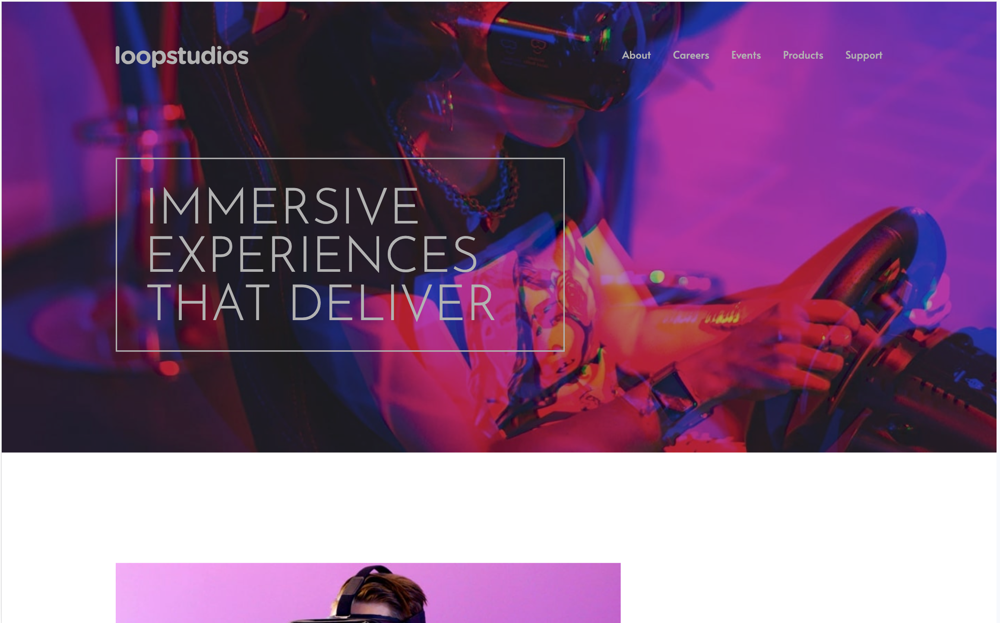

## About Me

- Instagram - [Add your name here](https://www.instagram.com/felipestefani/)
- LinkedIn - [@yourusername](https://www.linkedin.com/in/felipe-stefani-a35185116/)
- FrontendMentor - [@felipestefani](https://www.frontendmentor.io/profile/felipestefani)

# Frontend Mentor - Loopstudios landing page solution

This is a solution to the [Loopstudios landing page challenge on Frontend Mentor](https://www.frontendmentor.io/challenges/loopstudios-landing-page-N88J5Onjw). Frontend Mentor challenges help you improve your coding skills by building realistic projects. 

## Table of contents

- [Overview](#overview)
  - [The challenge](#the-challenge)
  - [Screenshot](#screenshot)
  - [Links](#links)
- [My process](#my-process)
  - [Built with](#built-with)
- [Author](#author)

## Overview

### The challenge

Users should be able to:

- View the optimal layout for the site depending on their device's screen size
- See hover states for all interactive elements on the page

### Screenshot

### Links

- Solution URL: [Add solution URL here](https://github.com/felipestefani/loopstudios)
- Live Site URL: [Add live site URL here](https://felipestefani.github.io/loopstudios/)

## My process

### Built with

- Semantic HTML5 markup
- CSS custom properties
- Flexbox
- [React](https://reactjs.org/) - JS library
- [Vite](https://vitejs.dev) - Vite

## Author

- Instagram - [Add your name here](https://www.instagram.com/felipestefani/)
- LinkedIn - [@yourusername](https://www.linkedin.com/in/felipe-stefani-a35185116/)
- FrontendMentor - [@felipestefani](https://www.frontendmentor.io/profile/felipestefani)

